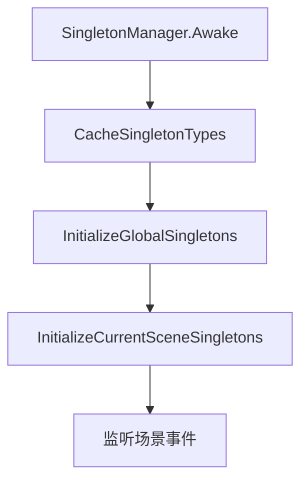
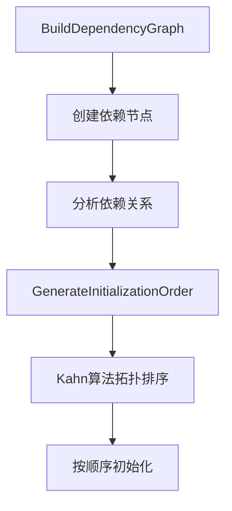
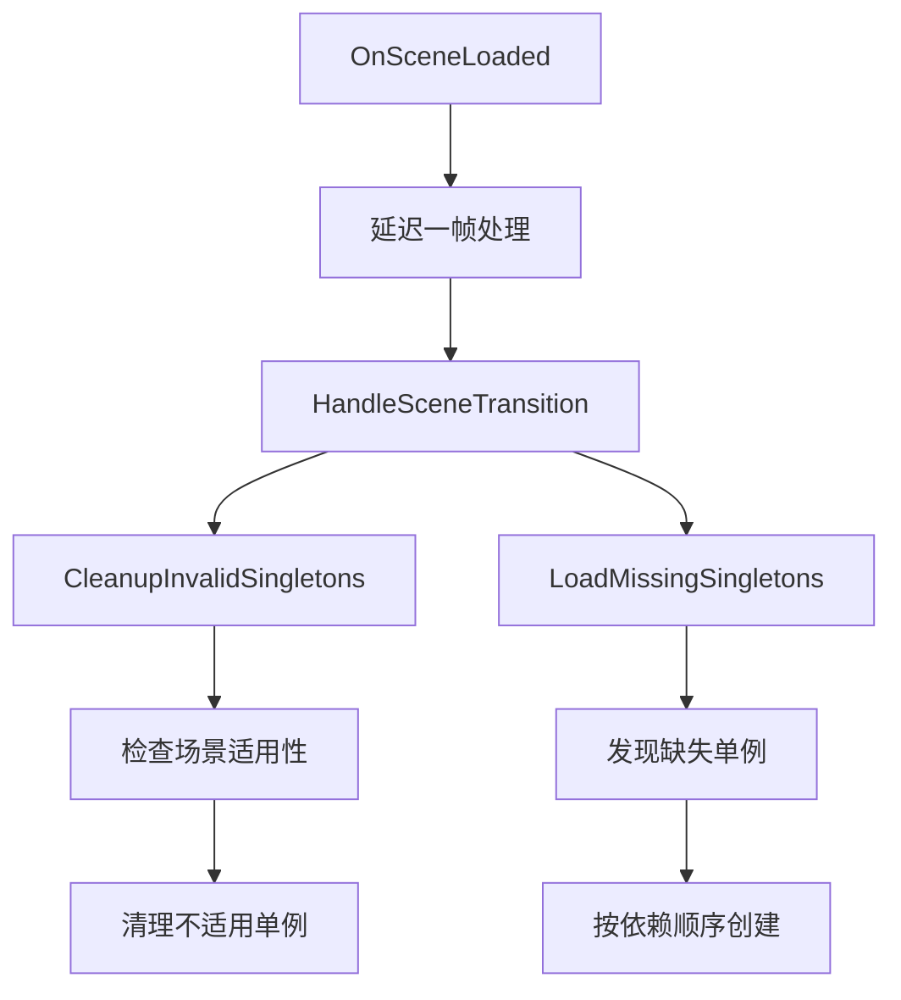
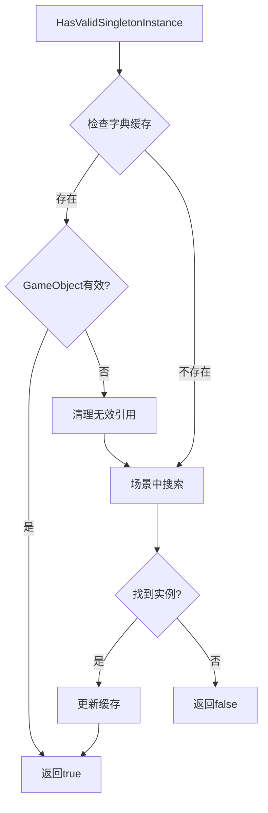

# 单例管理系统说明

## 概述

Happy Hotel的单例管理系统是一个强大的、基于特性的单例管理框架，支持场景特定的单例加载/卸载、依赖关系管理和自动初始化。该系统确保在任意场景切换时，所有应该存在的单例都被正确加载，所有不应该存在的单例都被正确卸载。

## 核心组件

### 1. SingletonManager（单例管理器）
**位置**: `Assets/Happy Hotel/Core/Singleton/SingletonManager.cs`

**职责**:
- 管理所有标记了`ManagedSingleton`特性的单例
- 处理场景切换时的单例加载/卸载
- 管理单例之间的依赖关系
- 提供统一的单例访问接口

**核心功能**:
- 自动发现并缓存所有单例类型
- 基于依赖关系的拓扑排序初始化
- 场景切换时的智能单例管理
- 异常处理和状态追踪

### 2. ManagedSingletonAttribute（单例特性）
**位置**: `Assets/Happy Hotel/Core/Singleton/ManagedSingletonAttribute.cs`

**配置选项**:
```csharp
// 全局单例（跨场景保持）
[ManagedSingleton(true)]

// 排除特定场景
[ManagedSingleton(SceneLoadMode.Exclude, "ShopScene")]

// 只在特定场景加载
[ManagedSingleton(SceneLoadMode.Include, "SampleScene", "GameScene")]

// 复合配置
[ManagedSingleton(SceneLoadMode.Exclude, true, "MapEditScene")]
```

### 3. SingletonBase<T>（单例基类）
**位置**: `Assets/Happy Hotel/Core/Singleton/SingletonBase.cs`

**功能**:
- 提供标准的单例模式实现
- 统一的生命周期管理
- 与`SingletonManager`的集成

### 4. SingletonDependencyAttribute（依赖特性）
**位置**: `Assets/Happy Hotel/Core/Singleton/SingletonDependencyAttribute.cs`

**用法**:
```csharp
[ManagedSingleton(SceneLoadMode.Exclude, "ShopScene")]
[SingletonDependency(typeof(GridObjectManager))]
[SingletonDependency(typeof(PropManager), false)] // 可选依赖
public class PropController : SingletonBase<PropController>
```

## 场景加载模式

### SceneLoadMode.All（默认）
- **行为**: 在所有场景都加载
- **适用**: 全局管理器，如`ActionManager`、`CharacterManager`

### SceneLoadMode.Include
- **行为**: 只在指定场景列表中的场景加载
- **适用**: 特定场景专用的管理器
- **示例**: `GameInitializer`只在`SampleScene`中加载

### SceneLoadMode.Exclude
- **行为**: 在除了指定场景外的所有场景加载
- **适用**: 需要Grid依赖但在某些场景（如Shop）中不需要的管理器
- **示例**: `LevelManager`、`PropController`排除`ShopScene`

## 工作原理

### 1. 系统初始化


**步骤说明**:
1. **类型缓存**: 扫描所有程序集，找到标记了`ManagedSingleton`的类型
2. **全局单例初始化**: 初始化所有`DontDestroyOnLoad=true`的单例
3. **场景单例初始化**: 初始化当前场景需要的单例
4. **事件监听**: 注册场景加载/卸载事件

### 2. 依赖关系管理


**特点**:
- **循环依赖检测**: 自动检测并报告循环依赖错误
- **可选依赖**: 支持必需和可选两种依赖类型
- **智能排序**: 确保依赖项在使用前已初始化

### 3. 场景切换处理


**核心逻辑**:
1. **清理阶段**: 移除不应在新场景存在的单例
2. **加载阶段**: 创建应该在新场景存在但缺失的单例
3. **状态同步**: 更新内部状态字典

### 4. 单例状态管理


## 使用指南

### 1. 创建新的单例
```csharp
using HappyHotel.Core.Singleton;

// 基础单例
[ManagedSingleton]
public class MyManager : SingletonBase<MyManager>
{
    protected override void OnSingletonAwake()
    {
        base.OnSingletonAwake();
        // 初始化代码
    }
}

// 场景特定单例
[ManagedSingleton(SceneLoadMode.Exclude, "ShopScene")]
[SingletonDependency(typeof(GridObjectManager))]
public class GameplayManager : SingletonBase<GameplayManager>
{
    // 实现
}
```

### 2. 访问单例
```csharp
// 直接访问
var manager = MyManager.Instance;

// 通过SingletonManager访问
var manager = SingletonManager.Instance.GetSingleton<MyManager>();
```

### 3. 调试单例状态
```csharp
// 打印当前场景的单例状态
SingletonManager.Instance.DebugPrintSingletonStates();

// 强制刷新单例状态
SingletonManager.Instance.RefreshCurrentSceneSingletons();
```

## 配置示例

### 全局单例（跨场景保持）
```csharp
[ManagedSingleton(true)]  // DontDestroyOnLoad=true
```
**适用**: `ActionManager`、`CharacterManager`、`ShopController`等

### Shop场景排除（需要Grid依赖）
```csharp
[ManagedSingleton(SceneLoadMode.Exclude, "ShopScene")]
```
**适用**: `PropController`、`LevelManager`、`GridObjectManager`等

### 特定场景专用
```csharp
[ManagedSingleton(SceneLoadMode.Include, "SampleScene")]
```
**适用**: `GameInitializer`等

## 场景切换流程

### 进入Shop场景
1. **清理阶段**: 销毁所有排除ShopScene的单例
2. **状态**: 排除的单例显示为"[○不需要]"
3. **保留**: 全局单例继续存在

### 从Shop返回
1. **检测阶段**: 发现应该存在但缺失的单例
2. **创建阶段**: 按依赖顺序重新创建缺失的单例
3. **状态**: 所有单例显示为"[✓已加载]"

## 状态指示器

在调试输出中，单例状态使用以下指示器：

- **[✓已加载]**: 应该存在且已正确加载
- **[✗缺失]**: 应该存在但未找到（系统会自动创建）
- **[✗多余]**: 不应该存在但仍然存在（系统会自动清理）
- **[○不需要]**: 不应该存在且确实不存在（正常状态）

## 异常处理

### SingletonInitializationException
系统定义的专用异常类型，包含以下错误类型：
- **MissingDependency**: 缺少必需的依赖
- **CircularDependency**: 检测到循环依赖
- **InitializationFailed**: 初始化失败

### 错误恢复
- 自动清理无效引用
- 重新尝试创建失败的单例
- 详细的错误日志和堆栈跟踪

## 性能优化

### 类型缓存
- 启动时一次性扫描所有单例类型
- 避免运行时反射调用
- 快速的类型查找

### 延迟处理
- 场景切换时延迟一帧处理
- 确保场景完全加载后再管理单例
- 避免时机问题

### 智能状态管理
- 只在需要时创建单例
- 自动清理无效引用
- 最小化内存占用

## 最佳实践

### 1. 依赖设计
- 明确定义单例之间的依赖关系
- 避免循环依赖
- 合理使用可选依赖

### 2. 场景配置
- 根据实际需求选择合适的加载模式
- 避免在不需要的场景加载重型单例
- 注意全局单例的内存影响

### 3. 错误处理
- 在单例初始化时进行必要的错误检查
- 提供有意义的错误信息
- 合理处理依赖缺失的情况

### 4. 调试支持
- 使用`DebugPrintSingletonStates()`监控单例状态
- 在场景切换时检查日志输出
- 利用状态指示器快速定位问题

## 扩展性

该系统设计时考虑了扩展性：

- **新增加载模式**: 可以扩展`SceneLoadMode`枚举
- **自定义依赖**: 可以扩展依赖关系的表达方式
- **事件系统**: 可以添加单例生命周期事件
- **配置文件**: 可以支持外部配置文件

## 总结

Happy Hotel的单例管理系统提供了一个完整、可靠的单例管理解决方案，特别适合需要复杂场景切换和依赖管理的Unity项目。通过统一的特性配置和自动化的生命周期管理，大大简化了单例的使用和维护，同时提供了强大的调试和错误处理能力。 